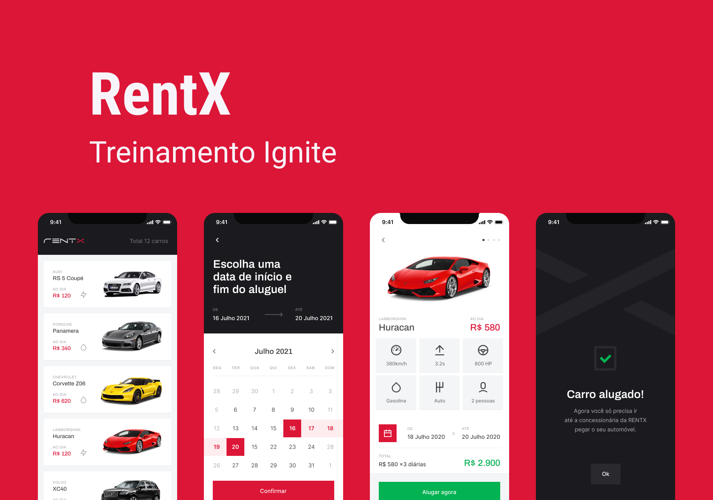

<h1 align="center">
  
</h1>

  

 

## 💻 Projeto app side

O RentX é um app para fazer agendamentos de carros com uma interface otimista

## ✨ Tecnologias

- [x] Expo
- [x] Typescript
- [x] Axios

## 📄 Licença

Esse projeto está sob a licença MIT. Veja o arquivo [LICENSE](LICENSE.md) para mais detalhes.

 

  
Desenvolvido por Evandro Assis

   

